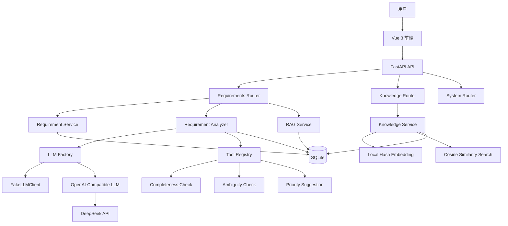
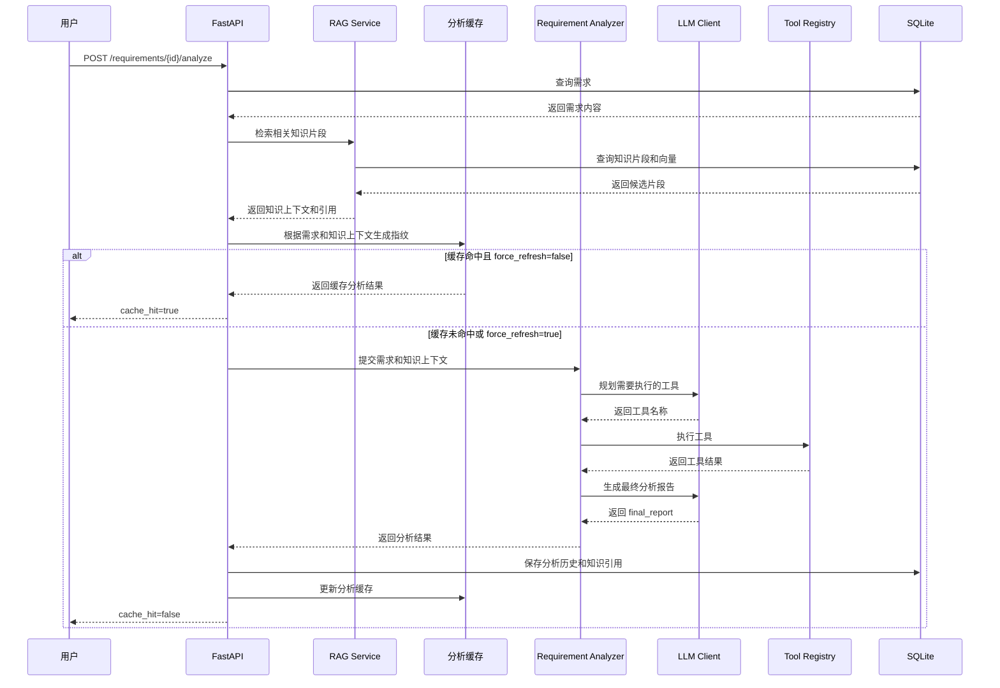
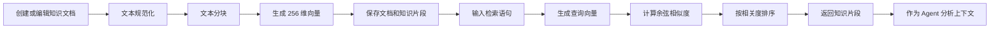

# ReqFlow Agent

[](https://github.com/wgy2021/reqflow-agent/actions/workflows/tests.yml)

ReqFlow Agent 是一个面向软件需求管理与智能分析场景的全栈 Agent 项目，包含需求管理、LLM 工具规划、RAG 知识库、分析历史、缓存、异常降级、自动化测试和容器化部署。

## 项目简介

系统围绕三条主线展开：

1. **需求管理**：管理软件需求的创建、查询、修改、删除、分页和优先级筛选。
2. **Agent 智能分析**：由大语言模型规划需要执行的分析工具，完成完整性检查、歧义检测、优先级建议，并生成最终分析报告。
3. **RAG 知识库**：管理知识文档，自动进行文本分块、向量生成和语义检索，并将检索结果作为需求分析上下文。

项目提供 Vue 3 可视化管理界面，并通过 FastAPI、SQLAlchemy、Alembic、Docker 和 GitHub Actions 完成后端服务、数据库版本管理、自动测试和持续集成。

## 核心功能

### 需求管理

- 支持需求创建、列表查询、详情查询、修改和删除
- 支持按优先级筛选
- 支持 `limit`、`offset` 分页参数
- 删除需求时同步清理分析历史和分析缓存
- 提供前端需求管理页面

### Agent 智能分析

- 使用 LLM Planner 规划需要执行的分析工具
- 使用 Tool Registry 统一注册和调度工具
- 支持完整性检查 `completeness_check`
- 支持歧义检测 `ambiguity_check`
- 支持优先级建议 `priority_suggestion`
- 根据工具执行结果生成自然语言最终报告
- 支持 FakeLLM 和真实 LLM 切换
- 支持 DeepSeek 等 OpenAI-Compatible API
- 真实模型调用失败时自动降级到 FakeLLM
- 返回 `llm_fallback_used` 和 `llm_error`
- 支持分析历史持久化和分页查询
- 支持 `force_refresh=true` 强制跳过缓存重新分析

### 分析缓存

- 基于需求标题、内容、优先级和知识上下文生成 SHA-256 内容指纹
- 相同输入重复分析时直接返回缓存结果
- 返回 `cache_hit=true` 标识缓存命中
- 需求内容变化后自动生成新指纹并使旧缓存失效
- 知识上下文变化后同样会触发重新分析

### RAG 知识库

- 支持知识文档创建、列表查询、详情查询、编辑和删除
- 创建文档时自动进行文本规范化和分块
- 使用本地字符 n-gram 哈希方式生成 256 维向量
- 使用余弦相似度进行语义检索
- 支持设置返回数量 `top_k`
- 支持设置最低相似度 `min_score`
- 编辑文档后自动删除旧片段并重新生成片段和向量
- 删除文档时同步删除关联知识片段
- 支持手动重建知识库索引
- 需求分析前自动检索相关知识片段
- 分析结果持久化保存知识引用、文档来源和相关度
- 前端支持知识文档增删改查、语义检索和重建索引

### 前端页面

- 工作台
- 需求管理
- 智能分析
- 分析历史
- 知识库管理
- 系统设置
- 后端健康状态展示
- 统一 API 请求封装
- Vite 开发代理配置

### 工程化

- 使用 Alembic 管理数据库结构版本
- 使用 pytest 编写单元测试和接口测试
- 当前共 **90 个自动化测试**
- 使用 Docker 构建后端镜像
- 使用 Docker Compose 启动后端服务
- 使用 Docker Volume 持久化 SQLite 数据
- 使用 GitHub Actions 自动执行数据库迁移验证、后端测试、前端构建、Docker 构建和容器健康检查

## 技术栈

### 后端

- Python 3.13
- FastAPI
- Uvicorn
- SQLAlchemy
- SQLite
- Alembic
- Pydantic
- pytest

### Agent 与 RAG

- LLM Planner
- Tool Registry
- FakeLLM
- OpenAI-Compatible API
- DeepSeek API
- LocalHashEmbeddingClient
- SHA-256 内容指纹
- 文本分块
- 余弦相似度检索

### 前端

- Vue 3
- Element Plus
- Vue Router
- Vite
- JavaScript

### 工程化

- GitHub Actions
- Docker
- Docker Compose
- Docker Volume

## 系统架构



## Agent 分析流程



## 知识库处理流程



## 项目结构

```text
reqflow-agent/
├── app/
│   ├── agent/
│   │   ├── llm/
│   │   │   ├── base.py
│   │   │   ├── fake.py
│   │   │   ├── factory.py
│   │   │   └── openai_compatible.py
│   │   ├── tools/
│   │   │   ├── ambiguity.py
│   │   │   ├── completeness.py
│   │   │   └── priority.py
│   │   ├── analyzer.py
│   │   ├── embeddings.py
│   │   ├── registry.py
│   │   └── schemas.py
│   ├── routers/
│   │   ├── knowledge.py
│   │   ├── requirements.py
│   │   └── system.py
│   ├── services/
│   │   ├── analyses.py
│   │   ├── knowledge.py
│   │   ├── rag.py
│   │   └── requirements.py
│   ├── config.py
│   ├── database.py
│   ├── main.py
│   ├── models.py
│   └── schemas.py
├── frontend/
│   ├── src/
│   │   ├── api/
│   │   │   ├── knowledge.js
│   │   │   ├── requirements.js
│   │   │   └── system.js
│   │   ├── router/
│   │   │   └── index.js
│   │   ├── views/
│   │   │   ├── AnalysisHistoryView.vue
│   │   │   ├── AnalysisWorkspaceView.vue
│   │   │   ├── DashboardView.vue
│   │   │   ├── KnowledgeBaseView.vue
│   │   │   ├── RequirementsView.vue
│   │   │   └── SystemSettingsView.vue
│   │   ├── App.vue
│   │   └── main.js
│   ├── .env.example
│   ├── index.html
│   ├── package.json
│   ├── package-lock.json
│   └── vite.config.js
├── migrations/
│   ├── versions/
│   │   ├── fb5144fe1c22_create_initial_schema.py
│   │   ├── 5f9e1c5fe475_add_knowledge_base_tables.py
│   │   └── ef576cf07c5a_add_knowledge_references_to_analyses.py
│   ├── env.py
│   ├── README
│   └── script.py.mako
├── tests/
│   ├── conftest.py
│   ├── test_analyzer.py
│   ├── test_embeddings.py
│   ├── test_fake_llm.py
│   ├── test_knowledge_api.py
│   ├── test_knowledge_repository.py
│   ├── test_knowledge_search.py
│   ├── test_knowledge_service.py
│   ├── test_llm_factory.py
│   ├── test_main.py
│   ├── test_openai_compatible_llm.py
│   ├── test_rag_service.py
│   ├── test_registry.py
│   └── test_system.py
├── .github/
│   └── workflows/
│       └── tests.yml
├── .dockerignore
├── .env.example
├── .gitignore
├── alembic.ini
├── compose.yaml
├── Dockerfile
├── README.md
└── requirements.txt
```

## 目录职责

- `app/routers`：定义 FastAPI 路由并处理 HTTP 请求。
- `app/services`：封装需求、分析历史、知识库和 RAG 业务逻辑。
- `app/agent/analyzer.py`：组织工具规划、工具执行和报告生成。
- `app/agent/registry.py`：注册并管理 Agent 工具。
- `app/agent/tools`：实现完整性、歧义和优先级分析工具。
- `app/agent/llm`：封装 FakeLLM、LLM 工厂和 OpenAI 兼容客户端。
- `app/agent/embeddings.py`：实现本地哈希向量生成、向量归一化和余弦相似度。
- `frontend/src/api`：封装前端对后端 API 的调用。
- `frontend/src/views`：实现各业务页面。
- `migrations`：保存 Alembic 配置和数据库迁移脚本。
- `tests`：保存单元测试和接口测试。
- `.github/workflows/tests.yml`：定义持续集成流程。
- `Dockerfile`：定义后端 Docker 镜像。
- `compose.yaml`：定义后端容器、端口、环境变量和数据卷。

## 环境要求

### 本地开发

- Python 3.13
- Node.js 22.18 或更高兼容版本
- npm
- Git

### 容器运行

- Docker Desktop
- Docker Compose

## 环境配置

### 后端配置

复制根目录示例配置：

```powershell
Copy-Item .env.example .env
```

默认使用 FakeLLM，不会调用真实大模型接口。

接入真实模型时，在根目录 `.env` 中配置：

```env
LLM_PROVIDER=your_provider
LLM_API_KEY=your_api_key
LLM_BASE_URL=your_base_url
LLM_MODEL=your_model_name
DATABASE_URL=sqlite:///./reqflow.db
```

请勿将包含真实 API Key 的 `.env` 提交到 Git。

### 前端配置

```powershell
cd frontend
Copy-Item .env.example .env.local
```

本地后端运行在 `8000` 端口时：

```env
VITE_BACKEND_PROXY_TARGET=http://127.0.0.1:8000
```

修改 `.env.local` 后，需要重新启动 Vite 开发服务器。

## 本地启动

本地开发需要分别启动后端和前端，两个终端都要保持运行。

### 1. 启动后端

```powershell
cd D:\projects\reqflow-agent

python -m venv .venv
.\.venv\Scripts\Activate.ps1

python -m pip install --upgrade pip
python -m pip install -r requirements.txt

Copy-Item .env.example .env
alembic upgrade head

python -m uvicorn app.main:app --reload --host 127.0.0.1 --port 8000
```

已经创建过虚拟环境和 `.env` 时，不需要重复创建或覆盖。

```text
Swagger: http://127.0.0.1:8000/docs
Health:  http://127.0.0.1:8000/health
```

### 2. 启动前端

```powershell
cd D:\projects\reqflow-agent\frontend

npm ci
Copy-Item .env.example .env.local
npm run dev
```

已经存在 `.env.local` 时，不要重复覆盖。

```text
Frontend: http://localhost:5173
```

## Docker 启动后端

当前 `Dockerfile` 和 `compose.yaml` 用于启动 **后端 API**。前端开发服务器仍需通过 `npm run dev` 单独启动。

### 构建并启动

```powershell
cd D:\projects\reqflow-agent
docker compose up -d --build
```

### 查看状态和日志

```powershell
docker compose ps
docker compose logs api
```

### 访问后端

```text
Swagger: http://127.0.0.1:8001/docs
Health:  http://127.0.0.1:8001/health
```

前端连接 Docker 后端时，将 `frontend/.env.local` 修改为：

```env
VITE_BACKEND_PROXY_TARGET=http://127.0.0.1:8001
```

然后重新启动前端：

```powershell
cd D:\projects\reqflow-agent\frontend
npm run dev
```

### 停止服务

```powershell
docker compose down
```

SQLite 数据保存在名为 `reqflow_data` 的 Docker Volume 中。删除并重建容器后，数据仍会保留。

不要随意执行：

```powershell
docker compose down -v
```

`-v` 会同时删除数据卷和其中的 SQLite 数据。

## 主要接口

### 系统接口

```text
GET /health
```

### 需求接口

```text
POST   /requirements
GET    /requirements
GET    /requirements/{requirement_id}
PATCH  /requirements/{requirement_id}
DELETE /requirements/{requirement_id}

POST   /requirements/{requirement_id}/analyze
GET    /requirements/{requirement_id}/analyses
```

查询需求列表：

```text
GET /requirements?priority=2&limit=20&offset=0
```

强制重新分析：

```text
POST /requirements/{requirement_id}/analyze?force_refresh=true
```

查询分析历史：

```text
GET /requirements/{requirement_id}/analyses?limit=20&offset=0
```

### 知识库接口

```text
POST   /knowledge/documents
GET    /knowledge/documents
GET    /knowledge/documents/{document_id}
PUT    /knowledge/documents/{document_id}
DELETE /knowledge/documents/{document_id}

GET    /knowledge/documents/{document_id}/chunks
GET    /knowledge/search
POST   /knowledge/reindex
```

分页查询知识文档：

```text
GET /knowledge/documents?limit=20&offset=0
```

语义检索：

```text
GET /knowledge/search?query=用户连续登录失败后应该如何处理&top_k=5&min_score=0.0
```

参数说明：

```text
query：检索文本，长度 1 到 1000
top_k：返回数量，范围 1 到 20
min_score：最低相似度，范围 -1.0 到 1.0
```

## 数据库迁移

```powershell
alembic current
alembic upgrade head
alembic check
alembic downgrade -1
```

正式数据执行回滚前，应先备份数据库。

## 自动化测试

运行全部后端测试：

```powershell
cd D:\projects\reqflow-agent
python -m pytest -q
```

当前结果：

```text
90 passed
```

测试覆盖：

- 健康检查和系统信息
- 需求 CRUD、分页和优先级筛选
- Agent 工具执行和 Tool Registry
- FakeLLM、LLM Factory 和 OpenAI-Compatible Client
- LLM 异常自动降级
- 分析历史、SHA-256 缓存和强制刷新
- 本地向量生成和余弦相似度
- 知识文档 CRUD 和文本分块
- 编辑文档后重新生成片段和向量
- 删除文档时清理知识片段
- 知识库语义检索和索引重建
- RAG 上下文组装和知识引用持久化

测试环境自动使用 FakeLLM，不会调用真实模型，也不会产生 API 费用。

## 前端构建

```powershell
cd D:\projects\reqflow-agent\frontend
npm ci
npm run build
```

成功时会显示：

```text
✓ built in ...
```

构建结果输出到 `frontend/dist`。

## 持续集成

每次执行 `push` 或创建 Pull Request 时，GitHub Actions 会自动完成：

```text
检出代码
→ 配置 Python 3.13
→ 安装后端依赖
→ Alembic upgrade head
→ Alembic downgrade base
→ Alembic 再次 upgrade head
→ Alembic check
→ 运行全部 pytest
→ 配置 Node.js 22
→ npm ci
→ npm run build
→ 构建 Docker 镜像
→ 启动 Docker 测试容器
→ 检查 /health
→ 清理测试容器
```

数据库迁移、后端测试、前端构建、Docker 构建或容器健康检查失败，工作流都会失败。

## 常用命令

### 后端

```powershell
cd D:\projects\reqflow-agent
.\.venv\Scripts\Activate.ps1
alembic upgrade head
python -m uvicorn app.main:app --reload --host 127.0.0.1 --port 8000
```

### 前端

```powershell
cd D:\projects\reqflow-agent\frontend
npm run dev
```

### 测试

```powershell
cd D:\projects\reqflow-agent
python -m pytest -q
```

### 前端构建

```powershell
cd D:\projects\reqflow-agent\frontend
npm run build
```

### Docker

```powershell
cd D:\projects\reqflow-agent
docker compose up -d --build
docker compose ps
docker compose logs api
docker compose down
```

## 项目亮点

- 使用 LLM Planner 让模型决定需要执行的工具，而不是写死固定流程。
- 使用 Tool Registry 解耦 Agent 与具体工具实现，便于继续扩展。
- 使用 FakeLLM 保证测试稳定、可重复且不产生真实 API 费用。
- 使用异常降级机制提高真实模型不可用时的系统可用性。
- 使用 SHA-256 内容指纹减少重复模型调用和 Token 消耗。
- 将 RAG 知识上下文纳入分析指纹，避免知识库变化后错误复用旧缓存。
- 实现知识文档增删改查、分块、向量生成、语义检索和索引重建闭环。
- 编辑知识文档后自动清理旧向量并生成新向量。
- 将知识引用持久化到分析历史，支持追踪报告依据。
- 使用 Alembic 管理数据库结构，避免应用启动时隐式建表。
- 使用 Vue 3 构建可操作的全栈管理界面。
- 使用 GitHub Actions 验证数据库、后端、前端和 Docker 完整链路。
- 使用 Docker Compose 和 Docker Volume 实现后端一键启动与数据持久化。

## 当前状态

当前已完成：

- 需求管理闭环
- Agent 工具规划与执行闭环
- 真实 LLM 接入和异常降级
- 分析历史与缓存
- Vue 3 前端页面
- RAG 知识库 CRUD
- 本地向量生成和语义检索
- 知识引用持久化
- 编辑后向量重建
- 手动索引重建
- 90 个自动化测试
- Alembic 数据库迁移
- Docker 后端部署
- GitHub Actions 完整 CI

项目当前可作为 LLM Agent、RAG、FastAPI 后端和全栈工程化方向的实习项目进行展示。
