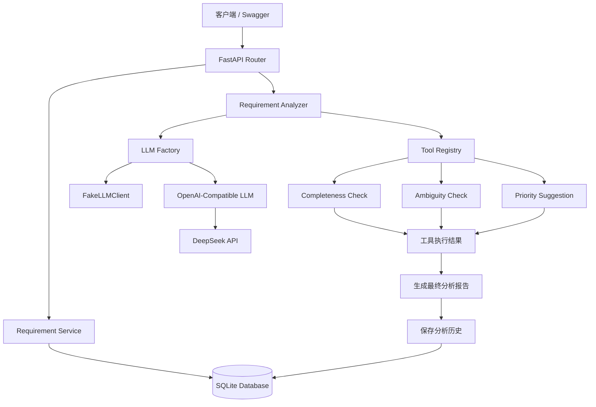
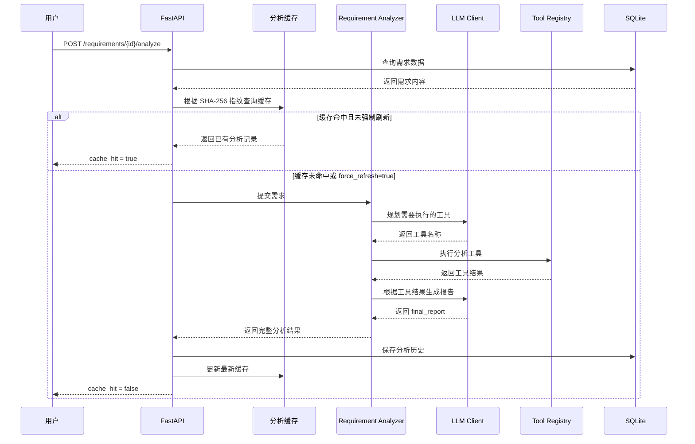

# ReqFlow Agent

[](https://github.com/wgy2021/reqflow-agent/actions/workflows/tests.yml)

## 项目简介

ReqFlow Agent 是一个基于 FastAPI、SQLAlchemy 和大语言模型构建的软件需求分析 Agent。

用户提交软件需求后，系统可以由大语言模型规划需要执行的分析工具，完成需求完整性检查、歧义检测和优先级建议，并根据工具执行结果生成结构化分析结果和自然语言报告。

项目同时实现了分析历史持久化、SHA-256 内容指纹缓存、缓存自动失效、强制刷新、LLM 异常降级、Alembic 数据库迁移、GitHub Actions 自动测试以及 Docker 一键部署。

## 核心功能

- 提供软件需求的创建、查询、修改和删除接口
- 支持需求列表分页和优先级筛选
- 使用大语言模型规划并选择分析工具
- 支持完整性检查、歧义检测和优先级建议
- 根据工具执行结果生成最终分析报告
- 支持 DeepSeek 等 OpenAI 兼容模型
- 支持 FakeLLM 与真实模型切换
- 支持真实 LLM 调用失败时自动降级
- 支持分析历史持久化和分页查询
- 支持基于 SHA-256 内容指纹的分析缓存
- 支持需求修改后缓存自动失效
- 支持 `force_refresh` 强制重新分析
- 删除需求时同步清理分析历史和缓存
- 使用 Alembic 管理数据库版本
- 使用 Docker Volume 持久化 SQLite 数据
- 使用 Docker Compose 一键启动服务
- 使用 GitHub Actions 自动验证数据库迁移和运行测试

## 技术栈

- Python 3.13
- FastAPI
- Uvicorn
- SQLite
- SQLAlchemy
- Alembic
- Pydantic
- pytest
- DeepSeek API
- OpenAI-Compatible API
- GitHub Actions
- Docker
- Docker Compose

## 项目架构



## Agent 执行流程



## 项目结构

```text
reqflow-agent/
├── app/
│   ├── agent/
│   │   ├── llm/
│   │   │   ├── base.py
│   │   │   ├── fake.py
│   │   │   ├── factory.py
│   │   │   └── openai_compatible.py
│   │   ├── tools/
│   │   │   ├── ambiguity.py
│   │   │   ├── completeness.py
│   │   │   └── priority.py
│   │   ├── analyzer.py
│   │   ├── registry.py
│   │   └── schemas.py
│   ├── routers/
│   │   └── requirements.py
│   ├── services/
│   │   ├── analyses.py
│   │   └── requirements.py
│   ├── config.py
│   ├── database.py
│   ├── main.py
│   ├── models.py
│   └── schemas.py
├── migrations/
│   ├── versions/
│   │   └── fb5144fe1c22_create_initial_schema.py
│   ├── env.py
│   ├── README
│   └── script.py.mako
├── tests/
│   ├── conftest.py
│   ├── test_analyzer.py
│   ├── test_fake_llm.py
│   ├── test_llm_factory.py
│   ├── test_main.py
│   ├── test_openai_compatible_llm.py
│   └── test_registry.py
├── .github/
│   └── workflows/
│       └── tests.yml
├── .dockerignore
├── .env.example
├── .gitignore
├── alembic.ini
├── compose.yaml
├── Dockerfile
├── README.md
└── requirements.txt
```

### 目录职责

- `app/routers`：定义 FastAPI 接口并处理 HTTP 请求。
- `app/services`：封装需求管理、分析历史和缓存相关业务逻辑。
- `app/agent/analyzer.py`：组织工具规划、工具执行和报告生成流程。
- `app/agent/registry.py`：注册并管理可以被 Agent 调用的工具。
- `app/agent/tools`：实现完整性检查、歧义检测和优先级建议。
- `app/agent/llm`：封装 FakeLLM、LLM 工厂和 OpenAI 兼容模型客户端。
- `app/models.py`：定义 SQLAlchemy 数据库模型。
- `migrations`：保存 Alembic 数据库迁移配置和版本脚本。
- `tests`：存放单元测试和接口测试。
- `.github/workflows/tests.yml`：自动验证 Alembic 迁移并运行 pytest。
- `Dockerfile`：定义 ReqFlow Agent Docker 镜像。
- `compose.yaml`：提供容器、端口、环境变量和数据卷配置。
- `.dockerignore`：排除虚拟环境、密钥、本地数据库和缓存文件。

## 环境配置

复制示例配置文件：

```powershell
Copy-Item .env.example .env
```

默认配置使用 FakeLLM，不会调用真实大模型接口。

需要接入真实模型时，请在 `.env` 中填写：

```env
LLM_PROVIDER=your_provider
LLM_API_KEY=your_api_key
LLM_BASE_URL=your_base_url
LLM_MODEL=your_model_name
```

数据库地址也可以通过环境变量配置：

```env
DATABASE_URL=sqlite:///./reqflow.db
```

请勿将包含真实 API Key 的 `.env` 文件提交到 Git。

## 本地运行

### 1. 创建虚拟环境

```powershell
python -m venv .venv
.venv\Scripts\Activate.ps1
```

### 2. 安装依赖

```powershell
python -m pip install --upgrade pip
python -m pip install -r requirements.txt
```

### 3. 执行数据库迁移

```powershell
alembic upgrade head
```

### 4. 启动 FastAPI

```powershell
uvicorn app.main:app --reload
```

启动后访问 Swagger：

```text
http://127.0.0.1:8000/docs
```

健康检查：

```text
http://127.0.0.1:8000/health
```

## Docker 一键启动

项目提供 `Dockerfile` 和 `compose.yaml`。

容器启动时会自动执行：

```text
alembic upgrade head
→ uvicorn app.main:app
```

### 构建并启动

```powershell
docker compose up -d --build
```

### 查看容器状态

```powershell
docker compose ps
```

### 查看运行日志

```powershell
docker compose logs api
```

### 访问服务

Swagger：

```text
http://127.0.0.1:8001/docs
```

健康检查：

```text
http://127.0.0.1:8001/health
```

### 停止服务

```powershell
docker compose down
```

SQLite 数据保存在名为 `reqflow_data` 的 Docker Volume 中。删除并重建容器后，需求和分析记录仍会保留。

请勿随意执行：

```powershell
docker compose down -v
```

其中 `-v` 会同时删除数据卷和其中的 SQLite 数据。

## 主要接口

```text
GET    /health

POST   /requirements
GET    /requirements
GET    /requirements/{requirement_id}
PATCH  /requirements/{requirement_id}
DELETE /requirements/{requirement_id}

POST   /requirements/{requirement_id}/analyze
GET    /requirements/{requirement_id}/analyses
```

### 查询需求列表

```text
GET /requirements?priority=2&limit=20&offset=0
```

参数说明：

```text
priority：可选，按优先级筛选
limit：每次最多返回的记录数量
offset：跳过的记录数量
```

### 强制刷新分析结果

```text
POST /requirements/{requirement_id}/analyze?force_refresh=true
```

普通分析会优先使用缓存：

```text
force_refresh=false
```

强制刷新会跳过缓存并重新执行 Agent：

```text
force_refresh=true
```

### 查询分析历史

```text
GET /requirements/{requirement_id}/analyses?limit=20&offset=0
```

分析历史默认按照最新记录在前的顺序返回。

## 数据库迁移

查看当前数据库版本：

```powershell
alembic current
```

升级到最新版本：

```powershell
alembic upgrade head
```

检查模型与数据库结构是否一致：

```powershell
alembic check
```

回滚一个版本：

```powershell
alembic downgrade -1
```

生产或正式数据环境执行回滚前，应先备份数据库。

## 运行测试

运行全部测试：

```powershell
python -m pytest -q
```

当前项目包含 56 个自动化测试，覆盖：

- 需求 CRUD
- 分页和筛选
- Agent 工具执行
- Tool Registry
- FakeLLM
- OpenAI 兼容客户端
- LLM 工厂
- 异常自动降级
- 分析历史持久化
- SHA-256 内容指纹缓存
- 强制刷新
- 删除需求时清理关联数据

测试环境会自动使用 FakeLLM，不会调用真实模型，也不会产生 API 费用。

## 持续集成

项目使用 GitHub Actions。

每次执行 `push` 或创建 Pull Request 时，会自动完成：

```text
安装依赖
→ Alembic upgrade head
→ Alembic downgrade base
→ Alembic 再次 upgrade head
→ Alembic check
→ 运行全部 pytest
```

任何数据库迁移错误或测试失败都会导致工作流失败。

## 项目亮点

- 通过 Tool Registry 解耦 Agent 与具体工具实现。
- 通过 LLM Factory 支持 FakeLLM 和 OpenAI 兼容模型切换。
- 通过异常降级机制提高外部模型调用失败时的可用性。
- 使用 SHA-256 内容指纹减少重复模型调用和 Token 消耗。
- 支持修改需求后缓存自动失效以及强制重新分析。
- 使用 Alembic 统一管理数据库结构，避免应用启动时自动建表。
- 使用 GitHub Actions 同时验证迁移脚本和自动化测试。
- 使用 Docker Compose 和 Docker Volume 实现一键部署与数据持久化。