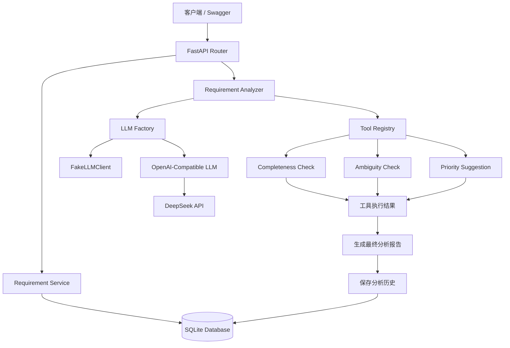
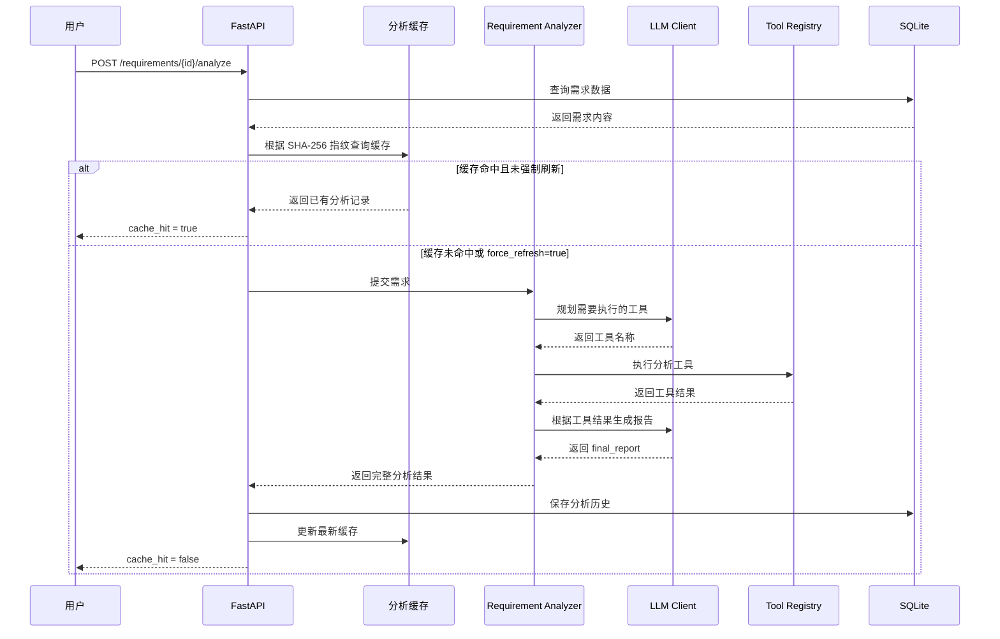

# ReqFlow Agent

[](https://github.com/wgy2021/reqflow-agent/actions/workflows/tests.yml)

## 项目简介

ReqFlow Agent 是一个基于 FastAPI、SQLAlchemy 和大语言模型构建的需求分析 Agent。

系统可以对软件需求进行完整性检查、歧义检测和优先级建议，并支持分析历史持久化、内容指纹缓存、LLM 异常降级和强制刷新。

## 核心功能

- 提供软件需求的创建、查询、修改和删除接口
- 使用大语言模型规划并执行需求分析工具
- 支持完整性检查、歧义检测和优先级建议
- 支持 DeepSeek 等 OpenAI 兼容模型
- 支持 LLM 调用异常时自动降级
- 支持分析历史持久化
- 支持基于 SHA-256 内容指纹的分析缓存
- 支持修改需求后自动失效缓存
- 支持强制刷新分析结果
- 使用 GitHub Actions 自动运行测试

## 技术栈

- Python 3.13
- FastAPI
- SQLite
- SQLAlchemy
- Pydantic
- pytest
- DeepSeek API
- GitHub Actions

## 项目架构



## Agent 执行流程



## 项目结构

```text
reqflow-agent/
├── app/
│   ├── agent/
│   │   ├── llm/
│   │   │   ├── base.py
│   │   │   ├── fake.py
│   │   │   ├── factory.py
│   │   │   └── openai_compatible.py
│   │   ├── tools/
│   │   │   ├── ambiguity.py
│   │   │   ├── completeness.py
│   │   │   └── priority.py
│   │   ├── analyzer.py
│   │   ├── registry.py
│   │   └── schemas.py
│   ├── routers/
│   │   └── requirements.py
│   ├── services/
│   │   ├── analyses.py
│   │   └── requirements.py
│   ├── config.py
│   ├── database.py
│   ├── main.py
│   ├── models.py
│   └── schemas.py
├── tests/
│   ├── conftest.py
│   ├── test_analyzer.py
│   ├── test_fake_llm.py
│   ├── test_llm_factory.py
│   ├── test_main.py
│   ├── test_openai_compatible_llm.py
│   └── test_registry.py
├── .github/
│   └── workflows/
│       └── tests.yml
├── .env.example
├── .gitignore
├── README.md
└── requirements.txt
```

### 目录职责

- `app/routers`：定义 FastAPI 接口并处理 HTTP 请求。
- `app/services`：封装需求管理、分析历史和缓存相关业务逻辑。
- `app/agent/analyzer.py`：组织工具规划、工具执行和报告生成流程。
- `app/agent/registry.py`：注册并管理可以被 Agent 调用的工具。
- `app/agent/tools`：实现完整性检查、歧义检测和优先级建议。
- `app/agent/llm`：封装 FakeLLM 和 OpenAI 兼容模型客户端。
- `app/models.py`：定义 SQLAlchemy 数据库模型。
- `tests`：存放单元测试和接口测试。
- `.github/workflows/tests.yml`：配置 GitHub Actions 自动测试。


## 环境配置

复制示例配置文件：

```powershell
Copy-Item .env.example .env
```

默认配置使用 FakeLLM，不会调用真实大模型接口。

需要接入真实模型时，请在 `.env` 中填写以下配置：

```env
LLM_PROVIDER=your_provider
LLM_API_KEY=your_api_key
LLM_BASE_URL=your_base_url
LLM_MODEL=your_model_name
```

请勿将包含真实 API Key 的 `.env` 文件提交到 Git。

## 本地运行

创建并激活虚拟环境：

```powershell
python -m venv .venv
.venv\Scripts\Activate.ps1
```

安装项目依赖：

```powershell
pip install -r requirements.txt
```

启动 FastAPI 服务：

```powershell
uvicorn app.main:app --reload
```

服务启动后访问 Swagger 接口文档：

```text
http://127.0.0.1:8000/docs
```

## 主要接口

```text
GET    /health
POST   /requirements
GET    /requirements
GET    /requirements/{requirement_id}
PATCH  /requirements/{requirement_id}
DELETE /requirements/{requirement_id}
POST   /requirements/{requirement_id}/analyze
GET    /requirements/{requirement_id}/analyses
```

强制刷新分析结果：

```text
POST /requirements/{requirement_id}/analyze?force_refresh=true
```

## 运行测试

```powershell
python -m pytest -q
```

项目每次执行 `push` 或创建 Pull Request 时，GitHub Actions 都会自动安装依赖并运行全部测试。