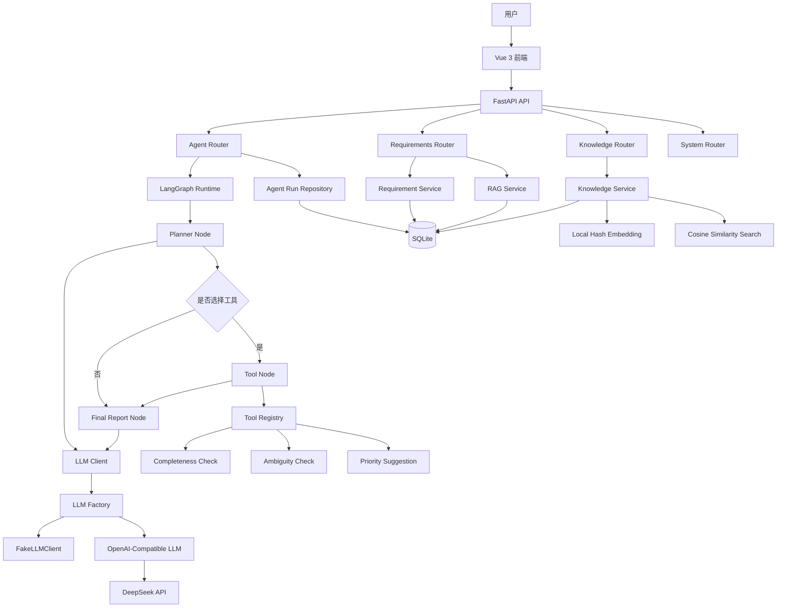
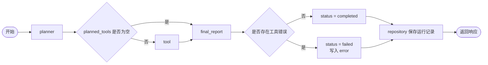
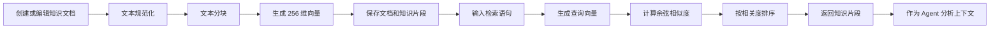

# ReqFlow Agent

[](https://github.com/wgy2021/reqflow-agent/actions/workflows/tests.yml)

ReqFlow Agent 是一个面向软件需求管理与智能分析场景的全栈 Agent 项目。项目以 FastAPI 为后端、Vue 3 为前端，集成 LangGraph 工作流、LLM 工具规划、RAG 知识库、Agent Evaluation、分析历史、缓存、异常降级、自动化测试和容器化部署。

## 项目简介

系统围绕五条主线展开：

1. **需求管理**：完成软件需求的创建、查询、修改、删除、分页和优先级筛选。
2. **Agent 智能分析**：由 LLM Planner 决定需要调用的分析工具，通过 LangGraph 编排工具执行与最终报告生成。
3. **Agent 运行记录**：保存每次运行的共享状态、工具调用轨迹、执行结果、最终报告和错误信息。
4. **RAG 知识库**：管理知识文档，自动完成文本分块、向量生成和语义检索，并将检索结果作为需求分析上下文。
5. **Agent Evaluation**：使用人工标注 JSONL 数据集评估 Planner 工具选择，统计 Exact Match、Precision、Recall、失败案例和 LLM 降级次数。

项目提供 Vue 3 可视化管理界面，并使用 FastAPI、SQLAlchemy、Alembic、pytest、Docker 和 GitHub Actions 完成后端服务、数据库版本管理、自动测试和持续集成。

## 核心功能

### 需求管理

- 支持需求创建、列表查询、详情查询、修改和删除
- 支持按优先级筛选
- 支持 `limit`、`offset` 分页
- 删除需求时同步清理关联分析历史和缓存
- 提供前端需求管理页面

### LangGraph Agent 工作流

- 使用 `planner` 节点读取需求并规划工具
- 使用条件路由判断是否进入 `tool` 节点
- 选中工具时执行 `planner → tool → final_report`
- 未选中工具时执行 `planner → final_report`
- 使用 Tool Registry 统一注册和调度工具
- 支持完整性检查 `completeness_check`
- 支持歧义检测 `ambiguity_check`
- 支持优先级建议 `priority_suggestion`
- 保存 `planned_tools`、`tool_calls`、`tool_results` 和 `final_report`
- 工具异常时捕获错误，不直接中断整个接口
- 工具异常运行标记为 `failed`，错误原因写入 `AgentState.error`
- 正常完成但需求检查未通过时保持 `status=completed`，使用 `passed=false` 表示质量检查结果

### LLM 接入与降级

- 支持 FakeLLM 和真实 LLM 切换
- 支持 DeepSeek 等 OpenAI-Compatible API
- 真实模型调用失败时自动降级到 FakeLLM
- 返回 `llm_fallback_used` 和 `llm_error`
- pytest 自动使用 FakeLLM，不调用真实 API

### Agent 运行记录

- 支持创建 Agent 运行、查询历史和查看详情
- 支持将运行与 `requirement_id` 关联
- 支持按需求筛选运行记录
- 保存运行状态 `completed` 或 `failed`
- 将完整 `AgentState` 保存到 `state_json`
- 独立保存 `status` 字段，便于数据库筛选和统计
- 工具失败时仍保存运行记录，便于用户查看和开发者排查
- 前端可展示失败状态、错误原因、工具调用轨迹和最终报告

### 分析缓存

- 基于需求标题、内容、优先级和知识上下文生成 SHA-256 内容指纹
- 相同输入重复分析时直接返回缓存结果
- 返回 `cache_hit=true` 标识缓存命中
- 支持 `force_refresh=true` 强制跳过缓存
- 需求内容或知识上下文变化后自动生成新指纹

### RAG 知识库

- 支持知识文档创建、列表查询、详情查询、编辑和删除
- 创建文档时自动进行文本规范化和分块
- 使用本地字符 n-gram 哈希方式生成 256 维向量
- 使用余弦相似度进行语义检索
- 支持设置返回数量 `top_k` 和最低相似度 `min_score`
- 编辑文档后自动删除旧片段并重新生成片段和向量
- 删除文档时同步删除关联知识片段
- 支持手动重建知识库索引
- 需求分析前自动检索相关知识片段
- 分析结果持久化保存知识引用、文档来源和相关度

### Agent Evaluation

- 使用 JSONL 保存人工标注的需求评测案例
- 评测时执行真实的 `execute_langgraph_analysis()` 链路
- 对比预期工具与 Planner 实际选择工具
- 统计 Exact Match、Precision、Recall、漏选工具和误选工具
- 聚合总案例数、失败案例 ID 和 LLM 降级次数
- 自动生成 JSON 与 Markdown 两种评测报告
- 当前提供 10 条 FakeLLM 确定性基线案例

> 当前 100% 结果仅表示 FakeLLM 在这 10 条规则型基线案例上的表现，不代表真实模型或生产环境准确率。

### 前端页面

- 工作台
- 需求管理
- 智能分析
- Agent 运行历史
- 运行详情与失败原因展示
- 知识库管理
- 系统设置
- 后端健康状态展示
- 统一 API 请求封装
- Vite 开发代理配置

### 工程化

- 使用 Alembic 管理数据库结构版本
- 使用 pytest 编写单元测试、接口测试和数据库持久化测试
- 当前共 **152 个自动化测试**
- 使用 Docker 构建后端镜像
- 使用 Docker Compose 启动后端服务
- 使用 Docker Volume 持久化 SQLite 数据
- 使用 GitHub Actions 自动执行数据库迁移验证、后端测试、前端构建、Docker 构建和容器健康检查

## 技术栈

### 后端

- Python 3.13
- FastAPI
- Uvicorn
- SQLAlchemy
- SQLite
- Alembic
- Pydantic
- pytest

### Agent 与 RAG

- LangGraph
- LLM Planner
- Tool Registry
- FakeLLM
- OpenAI-Compatible API
- DeepSeek API
- LocalHashEmbeddingClient
- SHA-256 内容指纹
- 文本分块
- 余弦相似度检索
- JSONL 人工标注评测数据集
- Exact Match / Precision / Recall
- JSON / Markdown 评测报告

### 前端

- Vue 3
- Element Plus
- Vue Router
- Vite
- JavaScript

### 工程化

- GitHub Actions
- Docker
- Docker Compose
- Docker Volume

## 系统架构


```mermaid
flowchart TD
    U[用户] --> F[Vue 3 前端]
    F --> API[FastAPI API]

    API --> REQ[Requirements Router]
    API --> AGENT[Agent Router]
    API --> KNOW[Knowledge Router]
    API --> SYS[System Router]

    REQ --> REQSVC[Requirement Service]
    REQ --> RAG[RAG Service]

    AGENT --> LG[LangGraph Runtime]
    LG --> PLAN[Planner Node]
    PLAN --> ROUTE{是否选择工具}
    ROUTE -->|是| TOOL[Tool Node]
    ROUTE -->|否| REPORT[Final Report Node]
    TOOL --> REPORT

    PLAN --> LLM[LLM Client]
    REPORT --> LLM
    LLM --> FACTORY[LLM Factory]
    FACTORY --> FAKE[FakeLLMClient]
    FACTORY --> REAL[OpenAI-Compatible LLM]
    REAL --> DS[DeepSeek API]

    TOOL --> REG[Tool Registry]
    REG --> C[Completeness Check]
    REG --> A[Ambiguity Check]
    REG --> P[Priority Suggestion]

    AGENT --> REPO[Agent Run Repository]
    REPO --> DB[(SQLite)]
    REQSVC --> DB
    RAG --> DB

    KNOW --> KS[Knowledge Service]
    KS --> EMB[Local Hash Embedding]
    KS --> SEARCH[Cosine Similarity Search]
    KS --> DB
```

## LangGraph 执行流程


```mermaid
flowchart LR
    START([开始]) --> P[planner]
    P --> D{planned_tools 是否为空}
    D -->|否| T[tool]
    D -->|是| F[final_report]
    T --> F
    F --> S{是否存在工具错误}
    S -->|否| C[status = completed]
    S -->|是| E[status = failed<br/>写入 error]
    C --> SAVE[repository 保存运行记录]
    E --> SAVE
    SAVE --> END([返回响应])
```

### 状态语义

```text
status=completed + passed=false
= Agent 工作流正常完成，但需求质量检查未通过

status=failed
= Agent 工作流执行异常，例如工具不存在、参数配置错误或工具抛出异常
```

### HTTP 状态与运行状态

```text
HTTP 201 + status=completed
= 运行记录创建成功，Agent 执行成功

HTTP 201 + status=failed
= 运行记录创建成功，但 Agent 执行失败

HTTP 500
= 后端未完成请求，例如数据库持久化失败
```

## Agent 运行时数据

`AgentState` 是整次 LangGraph 工作流共享的运行状态。各节点读取已有字段，并返回自己需要更新的字段。

常见字段包括：

```text
planned_tools
tool_calls
tool_results
final_report
status
error
```

数据流：

```text
planner 写入 planned_tools
→ tool 读取 planned_tools 并写入 tool_results
→ final_report 读取 tool_results 并生成最终报告
→ run_repository 将 AgentState 持久化为 AgentRunRecord
```

持久化时：

```text
AgentRunRecord.status
= 独立数据库字段，便于筛选和统计

AgentRunRecord.state_json
= 完整 AgentState 快照，便于恢复运行详情
```

## 知识库处理流程


```mermaid
flowchart LR
    A[创建或编辑知识文档] --> B[文本规范化]
    B --> C[文本分块]
    C --> D[生成 256 维向量]
    D --> E[保存文档和知识片段]
    E --> F[输入检索语句]
    F --> G[生成查询向量]
    G --> H[计算余弦相似度]
    H --> I[按相关度排序]
    I --> J[返回知识片段]
    J --> K[作为 Agent 分析上下文]
```

## 项目结构

```text
reqflow-agent/
├── app/
│   ├── agent/
│   │   ├── llm/
│   │   ├── tools/
│   │   ├── analyzer.py
│   │   ├── embeddings.py
│   │   ├── evaluation.py
│   │   ├── evaluation_report.py
│   │   ├── langgraph_runtime.py
│   │   ├── registry.py
│   │   ├── run_repository.py
│   │   └── schemas.py
│   ├── routers/
│   │   ├── agent.py
│   │   ├── knowledge.py
│   │   ├── requirements.py
│   │   └── system.py
│   ├── services/
│   ├── api_schemas.py
│   ├── config.py
│   ├── database.py
│   ├── main.py
│   ├── models.py
│   └── schemas.py
├── frontend/
│   └── src/
│       ├── api/
│       ├── router/
│       ├── views/
│       ├── App.vue
│       └── main.js
├── evals/
├── migrations/
├── reports/
├── scripts/
├── tests/
│   ├── test_agent_api.py
│   ├── test_agent_api_schemas.py
│   ├── test_agent_messages.py
│   ├── test_agent_run_repository.py
│   ├── test_agent_runtime.py
│   ├── test_langgraph_runtime.py
│   └── ...
├── .github/workflows/tests.yml
├── alembic.ini
├── compose.yaml
├── Dockerfile
├── README.md
└── requirements.txt
```

## 目录职责

- `app/routers`：接收 HTTP 请求、校验参数并组织业务流程。
- `app/routers/agent.py`：调用 LangGraph、运行仓库并返回 Agent 运行响应。
- `app/agent/langgraph_runtime.py`：构建和执行 LangGraph 工作流。
- `app/agent/evaluation.py`：定义单案例和批量工具选择评测指标。
- `app/agent/evaluation_report.py`：读取 JSONL 数据集并生成 JSON、Markdown 报告。
- `app/agent/run_repository.py`：将 `AgentState` 持久化为 `AgentRunRecord`。
- `app/agent/registry.py`：注册并管理 Agent 工具。
- `app/agent/tools`：实现完整性、歧义和优先级分析工具。
- `app/agent/llm`：封装 FakeLLM、LLM 工厂和 OpenAI 兼容客户端。
- `app/services`：封装需求、分析历史、知识库和 RAG 业务逻辑。
- `frontend/src/api`：封装前端对后端 API 的调用。
- `frontend/src/views`：实现各业务页面。
- `migrations`：保存 Alembic 配置和数据库迁移脚本。
- `evals`：保存人工标注的 Agent Evaluation 数据集。
- `reports`：保存可展示的评测结果。
- `tests`：保存单元测试、接口测试、持久化测试和评测测试。
- `.github/workflows/tests.yml`：定义持续集成流程。

## 环境要求

### 本地开发

- Python 3.13
- Node.js 22.18 或更高兼容版本
- npm
- Git

### 容器运行

- Docker Desktop
- Docker Compose

## 环境配置

### 后端配置

```powershell
Copy-Item .env.example .env
```

默认使用 FakeLLM，不会调用真实大模型接口。

接入真实模型时，在根目录 `.env` 中配置：

```env
LLM_PROVIDER=your_provider
LLM_API_KEY=your_api_key
LLM_BASE_URL=your_base_url
LLM_MODEL=your_model_name
DATABASE_URL=sqlite:///./reqflow.db
```

不要将包含真实 API Key 的 `.env` 提交到 Git。

### 前端配置

```powershell
cd frontend
Copy-Item .env.example .env.local
```

```env
VITE_BACKEND_PROXY_TARGET=http://127.0.0.1:8000
```

修改 `.env.local` 后，需要重新启动 Vite 开发服务器。

## 本地启动

### 1. 启动后端

```powershell
cd D:\projects\reqflow-agent
.\.venv\Scripts\Activate.ps1
python -m pip install -r requirements.txt
alembic upgrade head
python -m uvicorn app.main:app --reload --host 127.0.0.1 --port 8000
```

```text
Swagger: http://127.0.0.1:8000/docs
Health:  http://127.0.0.1:8000/health
```

### 2. 启动前端

```powershell
cd D:\projects\reqflow-agent\frontend
npm ci
npm run dev
```

```text
Frontend: http://localhost:5173
```

## Docker 启动后端

```powershell
cd D:\projects\reqflow-agent
docker compose up -d --build
docker compose ps
docker compose logs api
```

```text
Swagger: http://127.0.0.1:8001/docs
Health:  http://127.0.0.1:8001/health
```

停止服务：

```powershell
docker compose down
```

不要随意执行 `docker compose down -v`，该命令会删除数据卷和 SQLite 数据。

## 主要接口

### 系统接口

```text
GET /health
```

### 需求接口

```text
POST   /requirements
GET    /requirements
GET    /requirements/{requirement_id}
PATCH  /requirements/{requirement_id}
DELETE /requirements/{requirement_id}
POST   /requirements/{requirement_id}/analyze
GET    /requirements/{requirement_id}/analyses
```

### Agent 运行接口

```text
POST /agent/runs
GET  /agent/runs
GET  /agent/runs/{run_id}
```

创建与需求关联的运行：

```json
{
  "message": "分析这个需求",
  "max_steps": 5,
  "requirement_id": 1
}
```

失败运行也会保存并返回：

```json
{
  "run_id": 16,
  "status": "failed",
  "error": "unknown_tool: ValueError: No arguments configured for tool: unknown_tool"
}
```

### 知识库接口

```text
POST   /knowledge/documents
GET    /knowledge/documents
GET    /knowledge/documents/{document_id}
PUT    /knowledge/documents/{document_id}
DELETE /knowledge/documents/{document_id}
GET    /knowledge/documents/{document_id}/chunks
GET    /knowledge/search
POST   /knowledge/reindex
```

## 数据库迁移

```powershell
alembic current
alembic upgrade head
alembic check
alembic downgrade -1
```

正式数据执行回滚前，应先备份数据库。

## 自动化测试

```powershell
cd D:\projects\reqflow-agent
python -m pytest -q
```

当前结果：

```text
152 passed, 1 warning
```

测试覆盖：

- 健康检查和系统信息
- 需求 CRUD、分页和优先级筛选
- Agent 工具执行和 Tool Registry
- FakeLLM、LLM Factory 和 OpenAI-Compatible Client
- LLM 异常自动降级
- LangGraph Planner、Tool 和 Final Report 节点
- Agent 工具选择 Exact Match、Precision、Recall
- JSONL 评测数据读取、批量汇总和报告生成
- LangGraph 有工具和无工具的条件路由
- 工具调用轨迹 `tool_calls`
- 工具异常捕获和失败状态
- Agent 运行 API
- Agent 运行记录与需求关联
- 失败状态、错误原因和 `state_json` 持久化
- 分析历史、缓存、向量检索和 RAG 知识引用

测试环境自动使用 FakeLLM，不会调用真实模型，也不会产生 API 费用。

## Agent Evaluation

默认评测使用 FakeLLM，结果稳定、可重复，不调用真实模型接口。

运行 10 条人工标注基线案例：

```powershell
cd D:\projects\reqflow-agent
python scripts/run_agent_eval.py
```

当前 FakeLLM 基线结果：

```text
Total cases: 10
Exact match rate: 100.00%
Average precision: 100.00%
Average recall: 100.00%
LLM fallback count: 0
Failed case IDs: none
```

运行后自动生成：

```text
reports/agent_eval_report.json
reports/agent_eval_report.md
```

评测链路：

```text
JSONL 人工标注案例
→ execute_langgraph_analysis()
→ 获取 Planner 实际选择的工具
→ 对比预期工具
→ 计算 Exact Match / Precision / Recall
→ 输出失败案例和评测报告
```

当前结果是 FakeLLM 的规则基线，用于验证评测框架和回归能力，不代表真实 DeepSeek Planner 或生产环境的准确率。

## 前端构建

```powershell
cd D:\projects\reqflow-agent\frontend
npm ci
npm run build
```

构建结果输出到 `frontend/dist`。

## 持续集成

每次执行 `push` 或创建 Pull Request 时，GitHub Actions 会自动完成：

```text
检出代码
→ 配置 Python 3.13
→ 安装后端依赖
→ 验证 Alembic 迁移
→ 运行全部 pytest
→ 配置 Node.js
→ npm ci
→ npm run build
→ 构建 Docker 镜像
→ 启动 Docker 测试容器
→ 检查 /health
→ 清理测试容器
```

任一环节失败，工作流都会失败。

## 项目亮点

- 使用 LangGraph 显式编排 Planner、Tool 和 Final Report 节点。
- 使用条件路由跳过不必要的工具节点。
- 使用共享 `AgentState` 在节点之间传递计划、工具结果和最终报告。
- 使用 Tool Registry 解耦 Agent 与具体工具实现。
- 区分“需求检查未通过”和“Agent 执行失败”两类状态。
- 工具失败时捕获异常、生成失败报告并保存运行记录。
- 将完整 Agent 状态持久化到 `state_json`，同时使用独立 `status` 字段支持快速查询。
- 使用 FakeLLM 保证测试稳定、可重复且不产生真实 API 费用。
- 使用人工标注 JSONL 数据集量化评估 Planner 的工具选择，并输出可回归的失败案例。
- 使用真实 LLM 异常降级机制提高系统可用性。
- 使用 SHA-256 内容指纹减少重复模型调用和 Token 消耗。
- 实现知识文档增删改查、分块、向量生成、语义检索和索引重建闭环。
- 使用 Alembic 管理数据库结构。
- 使用 Vue 3 构建可操作的全栈管理界面。
- 使用 GitHub Actions 验证数据库、后端、前端和 Docker 完整链路。

## 当前状态

当前已完成：

- 需求管理闭环
- LangGraph Agent 工作流
- 工具规划、执行和最终报告生成
- 有工具和无工具的条件路由
- 工具异常捕获与失败状态
- Agent 运行记录持久化
- 运行记录与需求关联
- 失败原因和运行状态前端展示
- 真实 LLM 接入和异常降级
- 分析历史与缓存
- Vue 3 前端页面
- RAG 知识库 CRUD
- 本地向量生成和语义检索
- 知识引用持久化
- Alembic 数据库迁移
- Docker 后端部署
- GitHub Actions 完整 CI
- Agent Evaluation 数据集、聚合指标与报告生成
- 152 个自动化测试

项目当前可作为 LLM Agent、LangGraph、RAG、FastAPI 后端和全栈工程化方向的实习项目进行展示。
